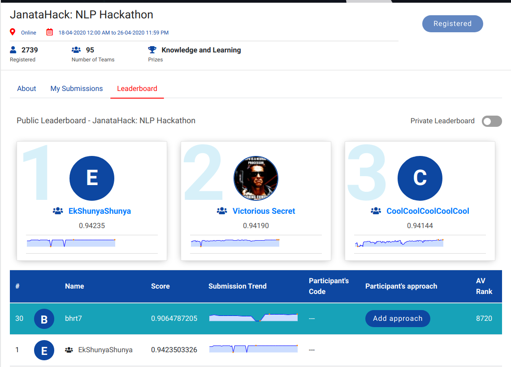

# Janta-NLP_Hackathon-For_Game_Reviews

#### I learnt a lot in this contest about NLP, and understood that the traditinal steps that are followed in the preprocessing of NLP problems is not a good idea always.

- I used BERT (Bidirectional Encoder Representations from Transformers) which is inspired from this paper [a link](https://arxiv.org/pdf/1810.04805.pdf) published by researchers at Google AI Language and is a state of art (SOTA) technique.

- I also used TFIDF and understood why it outperform most the famous architectures like Word2Vec in various cases when used along with Linear Regression as after using the TFIDF it becomes a linear problem and using of algo's like Boosting trees don't work in that case. 

- The link to TF-IDF using Linear Regression is [a link](https://github.com/bhrt-sharma/Janta-NLP_Hackathon-For_Game_Reviews/blob/master/increasing%20sentiment%20polarity.ipynb)

- Visualisation are also made in the same [a link](https://github.com/bhrt-sharma/Janta-NLP_Hackathon-For_Game_Reviews/blob/master/increasing%20sentiment%20polarity.ipynb).

- Link to Bert Modelling is [a link](https://github.com/bhrt-sharma/Janta-NLP_Hackathon-For_Game_Reviews/blob/master/nlp-using-bert.ipynb)

